# **Thai Siam Massage**
## Table of Contents
1. [User Experience](#user-experience)
    - [Goals](#goals)
    - [Business Goals](#business-goals)
    - [User Stories](#user-stories)
2. [Design](#design)
    - [Colour Scheme](#colour-scheme)
    - [Typography](#typography)
    - [Imagery](#imagery)
    - [Programs Used](#programs-used)
3. [Features](#features)
    - [General Features](#general-features)
    - [All pages](#all-pages)
    - [Nav bar](#nav-bar)
    - [Footer](#footer)
    - [Home Page](#home-page)
    - [Treatments](#treatments)
    - [Book Now](#book-now)
    - [Login](#login)
    - [Dashboard](#dashboard)
    - [Booking Success](#booking-success)
    - [Contact](#contact)
4. [Future Implementations](#future-implementations)
    - [Calender View](#main-dashboard-calendar-view)
    - [New Appointment Window (Modal/Popup)](#new-appointment-window-modalpopup)
    - [Customer Wallet](#customer-wallet)
5. [Technologies used](#technologies-used)
    - [Languages](#languages)
    - [Libraries](#libraries)
    - [Platforms](#platforms)
    - [Other Tools](#other-tools)
6. [Local Development & Deployment](#local-development--deployment)
    - [Local Development](#local-development)
        - [Local Preparation](#local-preparation)
        - [Local Instruction](#local-instruction)
    - [Heroku Deployment](#heroku-deployment)
        - [Repository Setup](#setting-up-your-git-repository)
        - [Heroku Setup](#setting-up-the-heroku-app)
7. [Testing](#testing)
    - [Methods](#methods)
    - [Validation](#validation)
    - [General Testing](#general-testing)
    - [Mobile Testing](#mobile-testing)
    - [Desktop Testing](#desktop-testing)
8. [Bugs](#bugs)
    - [known bugs](#known-bugs)
 
9. [Credits](#credits)
    - [Acknowledgement](#acknowledgement)
10. [Contact](#contact)


# Project 4 - Important Notes
For Project 4, I developed a Thai massage booking system using HTML, CSS, JavaScript, Django, and Bootstrap to create a seamless and interactive user experience. The website allows customers to book massage sessions, and cancel their appointments effortlessly. Django powers the backend, handling user data, appointments, and admin functionality. Bootstrap ensures the site is fully responsive and visually consistent across devices. Javascript handles sending emails, responsive navbar and time selections. This project not only demonstrates my ability to integrate multiple technologies but also provides a practical, real-world solution for managing bookings efficiently.

# User experience
## Goals
### Visitor Goals
- People who want to have best quality thai massage.
- People who have an interest Massage Parlour
- Massage Parlour who want to grow and expand their business.
- Massage Parlour who are needing help to meet their sales targets.
- Massage Parlour who are trying to expand the business, grow their business and create new departments.

### User goals are
- View information easily.
- Get different types of massages
- Contact the therapist easy with different options of contact
- Get therapy booking facility
- Cancel future bookings


### Business Goals
- Display and highlight what we are about.
- Get an understanding about what services we do.
- Get an understanding about what sectors we specialise in.
- Get people to contact us to get more information.
- Gain more customers.


### User Stories

<div align="center"> 
    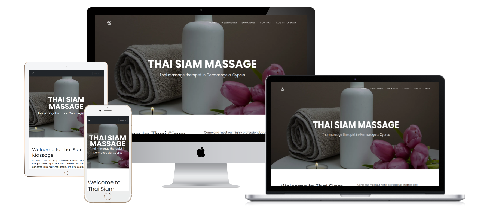
</div> 

- As a company I would like to see what relevant experience the massage parlour has in my area of business.
- I would like to see what types of therapy the massage parlour specialise in.
- As a customer looking at optimising my business's profitability and Growth i would like to see what type of massage therapy they offer throughout my business.
- While visiting a massage therapy website, I want to Navigate through their different types of therapies seamlessly and have a direct link to contacting them. 
- I want to be able to contact the therapist with direct open-ended questions.
- I would want an understanding of the therapist background and experience in all areas. 
- I want to be able to review the site and get the detail I need easily without reading huge amount of text.
- Where I want to, I want to be able to get more detail on the specific therapy I am interested.
- As a company I want to be able to the site wherever I am in on any form device and get an easy fluent way to navigate, find the information easy and have high-lighted points as my time is sparse.
- I would like book sessions from the website with different types of therapy date and time.
- I would like to cancel any future schedule.


# Design
## Colour Scheme
<div align="center"> 
    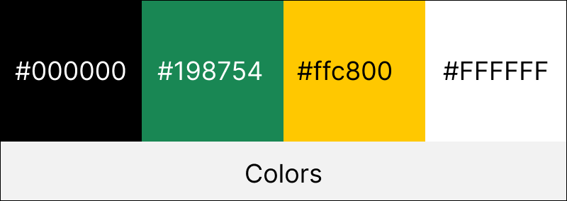
</div> 

- #000000 was used in all the font text
- #198754 was used as the main color such as Footer Background, Button Text, Border and backgraund
- #ffc800 was used as the hover color of the navbar links
- #FFFFFF was the main background on all ages

## Typography

<div align="center"> 
    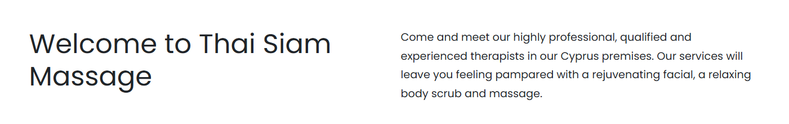
</div>

- My primary font is [Poppins](https://fonts.google.com/specimen/Poppins?query=poppins) which is on all pages of the website
- I used Poppins font as it is clear for everyone to read, whilst also having a great style look for a Massage Parlour


## Imagery
<div align="center"> 
    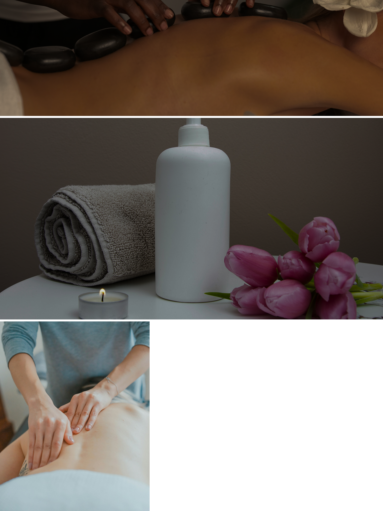
</div> 

- These are the photos I used for my website that all are copright free.
- I researched hundreds of photos to get the best image to represent the relevant area of my business.
- They matched in line with the Businesses and the sectors we are working in.


## Programs Used
- [Link to simple imager resizer](https://www.simpleimageresizer.com/)

- [Link to tiny png](https://tinypng.com/)

- [Link to free convert](https://www.freeconvert.com/)
    - These are the programs I used to resize and convert the image to increase the performance of the site for mobile and desktop usage.


# Features
## General features
### All pages
## Nav Bar
<div align="center"> 
    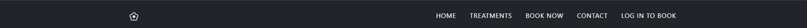
</div> 

- This Nav bar is on all pages with the minimal design. 
- This Nav bar is fixed in place, so when you scroll down you can still access all pages.
- If you click on the logo, it will take you back to the home page. 
- Project 4 - There is now 5 pages, as there is a dashboard page added for the user to get more booking table of the future bookings

<div align="center"> 
    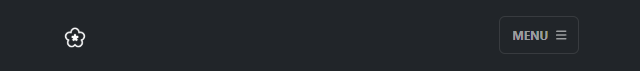
</div> 

- This is the look of the nav bar in the format of a phone
- I wanted it to look sleeker and user friendly in the style.
- Anything below 768px will show this format by using media queries. 

<div align="center"> 
    
</div> 

- This is the look of the Hamburger Nav.
- When you click on the Menu Button it brings the Nav list up.
- If you click on the logo, it will take you back to the home page.

## Footer
<div align="center"> 
    
</div> 

- This footer is also accessible on all pages.
- The footer also holds the Privace Ploicy and Terms and Conditions but those are not working. You have to add you own terms and conditions and privacy policies.
- The is aligned into the middle of the screen and always white in color.
-  Project 4 - Twitter, Facebook, and Linkedln social links added but they are not functional.

<div align="center"> 
    
</div> 

- This is what the phone looks like in the phone format.
- Anything below 768px will show this format using media queries.


## Home Page
<div align="center"> 
    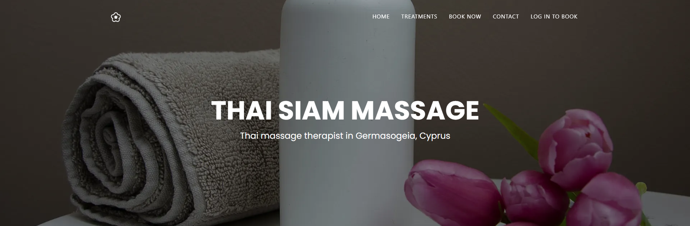
</div> 

- This is my main page Hero, I wanted to make it eye catching, stylish, easy to read, easy to navigate, while also been user friendly.
- With hours of research I thought this iamge was the best way to convey the type of my business.

<div align="center"> 
    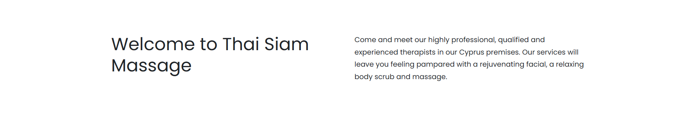
</div> 

- I added this text to make the front page be attractive to the eye, whilst also been business specific.
- Knowing that there is no background iamge, I wanted to add text to it to draw people in.


<div align="center"> 
    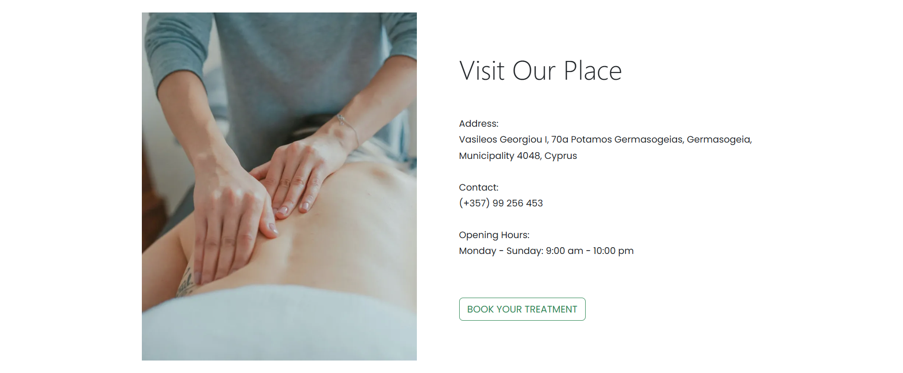
</div> 

- Project 4 - I created a section where people can find our place easily.
- It gives the end user another direct link into the Booking page.


## Treatments
<div align="center"> 
    
</div> 

- All the treatments with title, description, price and duration are visible
- It gives the end user another direct link into the Booking page.


## Book now
<div align="center"> 
    
</div> 

- Treatment booking form where user have to select treatment type, treatment duration, time and date to book a schedule
- User must have to be a registered user of Thai Siam Massage and have to login first to book a treatment.


## Login
<div align="center"> 
    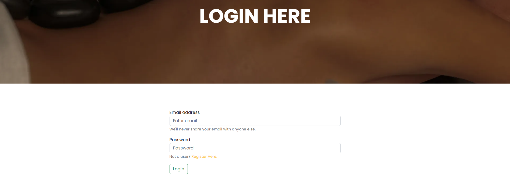
</div> 

- Customer login page where user have to provide email and password to login.
- User must have to be a registered user of Thai Siam Massage to login
- Direct link to the register page if user is not registered


## Dashboard
<div align="center"> 
    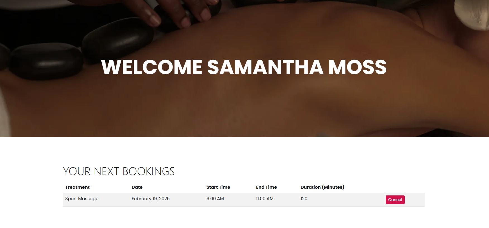
</div> 

- After login user will redirect to the dashboard page
- Future bookings of the user are there as a table
- User can cancel any booking anytime with the cancel button

## Booking Success
<div align="center"> 
    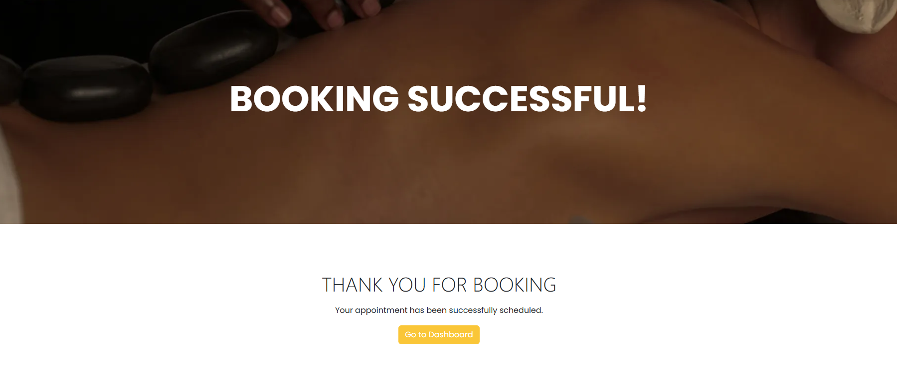
</div> 

- After booking a schedule user will redirect to the booking success page
- Direct link for user to navigate to the dashboard


## Contact
<div align="center"> 
    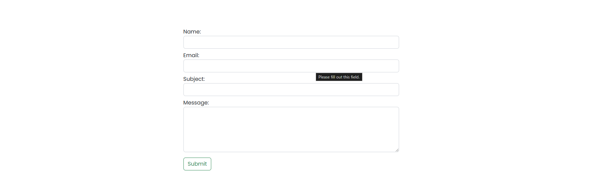
</div> 

- User can send us messages through this form that will be saved to the databse
- User's message will send to the owner's email


## Future Implementations

### Main Dashboard (Calendar View)
- Time Slots: Start: 09:00 AM | End: 10:00 PM
- Supports appointments on Hour, 30 mins, 15 mins
- Drag and Drop for easy rescheduling
- Color-coded based on therapist, type of massage, or status
- Appointment Slots:
    - Click on a time slot to open the New Appointment Window
    - Neutral color slots can be used as labels/comments

### New Appointment Window (Modal/Popup)

- Customer Details
    - Name (Text Field)
    - Phone Numbers (Multiple Supported)
    - Duration (Dropdown: 15/30/45/60 mins, etc.)
    - Therapist Requested? (Checkbox)

- Massage Details
    - Type of Massage (Dropdown)
    - Color Selection (15 colors)
    - Repeat Appointment (Checkbox + Frequency Selector)


- Pricing & Payment
    - Automated Cost Calculation (Editable Field)
    - Payment Received? (Checkbox for money tracking)
    - Customer Wallet Payment Methods:
        - Viva | Cash | Revolut | Voucher

- Refund Button with Comments
- Reminders & Confirmation
- Send Confirmation? (Yes/No Toggle)
- Comments & Notes
- Visible Comments:
    - Massage Type, Therapist Requested, Phone Number


- Hidden Comments (Double Click to Access):
    - Credit Balance/Vouchers & Prepayments
    - Cancellation Debt (Red), Positive Balance (Green), Credit (Orange)


### Customer Wallet
- Balance Tracking
    - Displays remaining balance
    - Funds can be loaded via Viva, Cash, Revolut, Voucher
    - Refund option available


- Voucher Wallet
    - Unique Voucher Numbers
    - Payment via Viva, Cash, Revolut
    - Balance Auto-Deducted on use
    - Option to Transfer Voucher Balance to Customer Wallet


- Cash Payments
    - Separate tracking for two cash boxes


# Technologies used
## Languages
- [HTML](https://developer.mozilla.org/en-US/docs/Web/HTML)
    - Page markup
- [CSS](https://developer.mozilla.org/en-US/docs/Learn/CSS)
    - Styling
- [Django](https://www.djangoproject.com/)
    - Project Backend
- [AWS](https://aws.amazon.com/)
    - Project Database
- [Postgresql](https://www.postgresql.org/)
    - Database
## Libraries 
- [Google Fonts](https://fonts.google.com/)
    - Font style
- [Bootstrap](https://getbootstrap.com/)
    - App Theme and Styling
## Platforms
- [Github](github.com)
    - Store the code remotely for deployment
- [Gitpod](gitpod.io)
    - Development environment for the project
- [Heroku](https://www.heroku.com/)
    - Deployment of the project


# Local Development & Deployment
## Local Development
### Local Preparation
**Requirements**
- IDE like [Visual Studio Code](https://code.visualstudio.com/download)
- [Git](https://git-scm.com/)
- [Python](https://www.python.org/downloads/)
- [Django](https://www.djangoproject.com/)

### Local Instruction
1. Clone the repository and go inside the folder
```
git clone https://github.com/samanthamoss87/thai_massage.git
```
2. Open your IDE and open the folder you just cloned
3. Change the database configuration of the app in thai_massage/settings.py
```
DATABASES = { 
    'default': { 
        'ENGINE': 'django.db.backends.sqlite3', 
        'NAME': BASE_DIR / "db.sqlite3"
    }
}
```
4. Open the terminal and run these commands to create the database
```
python manage.py makemigrations
python manage.py migrate
python manage.py createsuperuser
```
5. Now run this command to run the website
```
python manage.py runserver
```
4. Enjoy the site

## Heroku Deployment
### Setting up your git repository
1. Create a new repository and clone it to your computer
2. Put all the files to the repository folder
3. Create a file called `.python-version` and add python version to it. eg. 3.12
4. Create a file called Procfile and add this to the file `web: gunicorn your-project-name.wsgi --log-file -`
5. Replace `your-project-name` to your project name eg. thai-massage
6. Now run these commands to upload the files to Github 
    - `git add .`
    - `git commit -m "your commit message"`
    - `git push`

### Setting up the heroku app
7. Login to your [Heroku](https://www.heroku.com/) account
8. Create a new app and give it a name
9. Connect your github account from deployment method
10. Search and Select your repository
11. Click on Deploy


# Testing

## Methods
### Validation 
- HTML has been validated with https://validator.w3.org/#validate_by_input
- CSS has been validated with https://jigsaw.w3.org/ and auto-prefixed with https://autoprefixer.github.io/.
- Links checked with https://validator.w3.org/checklink.
- I also used https://pagespeed.web.dev/
- Javascript codes have been validated with https://jshint.com/

### General Testing 
- Each feature was testing when it implemented into the code on both safari and chrome.
- The site was sent to family and friend to review and get their feedback.
- Contact us form have validation and will not submit without all information filled in.
- The images were testing on all devices and browsers for performance/load speed. 

### Mobile Testing
 - I tested the site on IOS and Android device using my phone and family members phone, going through the entire process, checking button, functions, load speed, style etc.         
- Chrome and Microsoft edge was used to inspect the site in mobile format, looking at functions, responsiveness and style.

### Desktop Testing 
- The website was designed on Microsoft laptop, and it was previewed in Chrome and Microsoft edge. 
- The website was tested by family and friends and numerous different devices.


# Bugs
## Known bugs
- When admin and user login from the same browser, the username from userdashboard vanishes if the superuser doesn't have a name
- Custom 404 Page is not working properly
- User doesn't get any email after booking a schedule due to smtp server error
- Privacy Policy and Terms and conditions page is not working
- Automated git deployment is not working


# Credits

## Acknowledgement
- My joint business partner of Thai Siam Massage and Richard Lane helped me make the blueprint of the app

# Contact
- Please feel free to contact me at samantha.moss87@aol.com